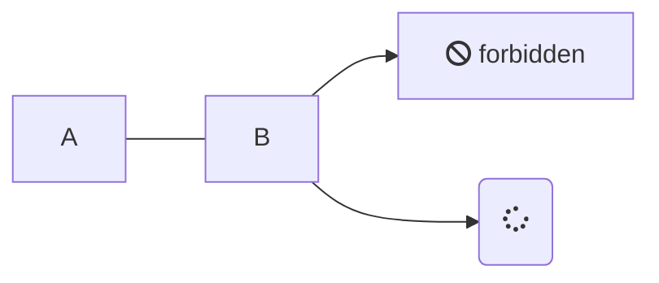

# Описание разметки **MARKDOWN**
___

## Разделительная черта
___
При использовании
```md
___
```

## Заголовки
Всего существует шесть уровней заголовков. Для того, чтобы создать заголовок, необходимо в начале строки добавить символы #, в количестве равном его уровню.

```md
# Заголовок первого уровня
```
```md
## Заголовок второго уровня
```
```md
### Заголовок третьего уровня
```
```md
#### Заголовок четвертого уровня
```
```md
##### Заголовок пятого уровня
```

```md
###### Заголовок шестого уровня
```
## Выделение текста
### ~~Зачеркнутый текст~~
```
~~Зачеркнутый текст~~
```
### Bold и Italic
Для выделения текста **жирным** или *наклонным* и их сочетания можно использовать комбинации ```*``` или ```_``` 

__Жирный текст__
```
__Жирный текст__
**Жирный текст**
```
_Наклонный текст_
```
_Наклонный текст_
*Наклонный текст*
```
___Жирный наклонный текст___
```
___Жирный наклонный текст___
***Жирный наклонный текст***
```
## Использование эмодзи (emoji) :sunglasses:
В самом тексте можно использовать эмодзи, например написать вот так:

:heavy_check_mark: Это уже сделано    
:negative_squared_cross_mark: Я не буду это делать    
:black_square_button: делать или не делать, вот в чем вопрос?

```
:heavy_check_mark: Это уже сделано    
:negative_squared_cross_mark: Я не буду это делать    
:black_square_button: делать или не делать, вот в чем вопрос?
```
:newspaper: Список работающих Эмодзи находится тут :point_right: [emoji.md](https://github.com/GnuriaN/format-README/blob/master/emoji.md)
## Использование цитирования в тексте
> Цитата (уровень 1)    
> > Вложенная цитата (уровень 2)    
> > > Вложенная цитата (уровень 3)    

> > Продолжение цитаты (уровень 2)    

> Продолжение цитаты (уровень 1)  
```
> Цитата (уровень 1)    
> > Вложенная цитата (уровень 2)    
> > > Вложенная цитата (уровень 3)    

> > Продолжение цитаты (уровень 2)    

> Продолжение цитаты (уровень 1)  
```
## Подсветка кода
### Выделение слова
Если нужно выделить слово или фразу внутри строки, то используются одинарные обратные кавычки (`):

Это `слово` будет выделено
```
Это `слово` будет выделено
```

### Выделение блока
Для выделения в блоки - тройные:
```
    ```
        Здесь может быть
        Ваша реклама
    ```
```
### Выделение кода
Дополнительно можно задавать язык кода внутри блока, указав его после первых трех кавычек:
 ```html
        <input type="text">
```

```css
    body {
        margin: 0;
        padding: 0;
    }
```

```php
    <?php phpinfo();?>
```

```
    ```html
        <input type="text">
    ```

    ```css
        body {
            margin: 0;
            padding: 0;
        }
    ```

    ```php
        <?php phpinfo();?>
    ```
```
## Списки
### Маркированный
Задать **маркированный** список можно несколькими символами ```-```, ```+``` или ```*```:
- Уровень списка 1. Пункт 1.
* Уровень списка 1. Пункт 2.
+ Уровень списка 1. Пункт 3.

```
    - Уровень списка 1. Пункт 1.
    * Уровень списка 1. Пункт 2.
    + Уровень списка 1. Пункт 3.
```
Можно создавать многоуровневые списки. Каждый уровень отделяется четырьмя (4) пробелами:
- Уровень списка 1. Пункт 1.
    - Уровень списка 2. Пункт 1.
- Уровень списка 1. Пункт 2.
    - Уровень списка 2. Пункт 1.
    - Уровень списка 2. Пункт 2.
- Уровень списка 1. Пункт 3.
    - Уровень списка 2. Пункт 1.
        - Уровень списка 3. Пункт 1.
        - Уровень списка 3. Пункт 2.
           - Уровень списка 4. Пункт 1.

### Нумерованный и смешанный
!> Лучше использовать стандартные ```html-тэги```

<ol>
    <li>AAA
        <ol type="a">
            <li>BBB</li>
            <li>CCC
                <ol type="i">
                    <li>DDD</li>
                    <li>FFF</li>
                    <li>GGGS</li>
                </ol>
            </li>
        </ol>
    </li>
</ol>

```
<ol>
    <li>AAA
        <ol type="a">
            <li>BBB</li>
            <li>CCC
                <ol type="i">
                    <li>DDD</li>
                    <li>FFF</li>
                    <li>GGGS</li>
                </ol>
            </li>
        </ol>
    </li>
</ol>
```
?> __ВАЖНО__  Для разных типов нумерации в тэге ```<ol>``` нужно устанавливать соотвествующий атрибут ```type``` _смотри таблицу_

<table>
    <thead>
        <tr>
            <th>Тип списка</th>
            <th>Код HTML</th>
            <th>Пример</th>
        </tr>
    </thead>
    <tbody>
        <tr>
            <td>Арабские числа</td>
            <td>type="1"</td>
            <td>
                1. Чебурашка<br>
                2. Крокодил Гена<br>
                3. Шапокляк
            </td>
        </tr>
        <tr>
            <td>Прописные буквы латинского алфавита</td>
            <td>type="A"</td>
            <td>
                A. Чебурашка<br>
                B. Крокодил Гена<br>
                C. Шапокляк
            </td>
        </tr>
        <tr>
            <td>Строчные буквы латинского алфавита</td>
            <td>type="a"</td>
            <td>
                a. Чебурашка<br>
                b. Крокодил Гена<br>
                c. Шапокляк
            </td>
        </tr>
        <tr>
            <td>Римские числа в верхнем регистре</td>
            <td>type="I"</td>
            <td>
                I. Чебурашка<br>
                II. Крокодил Гена<br>
                III. Шапокляк
            </td>
        </tr>
        <tr>
            <td>Римские числа в нижнем  регистре</td>
            <td>type="i"</td>
            <td>
                i. Чебурашка<br>
                ii. Крокодил Гена<br>
                iii. Шапокляк
            </td>
        </tr>
    </tbody>
</table>

## Список задач
(Task List) Можно создавать "Списки задач" для этого необходимо использовать ```- [ ]``` для поставленной задачи и ```- [X]``` для выполненной задачи.
- [X] Придумать внешний вид резюме
- [ ] Написать основные категории
- [X] Опубликовать
```
    - [X] Придумать внешний вид резюме
    - [ ] Написать основные категории
    - [X] Опубликовать
```
Также можно создавать многоуровневые списки задач. Каждый уровень отделяется четырьмя `(4) пробелами`
- [X] Задача 1
    - [X] Подзадача 1 для Задачи 1
    - [X] Подзадача 2 для Задачи 1
- [ ] Задача 2
    - [X] Подзадача 1 для Задачи 2
    - [ ] Подзадача 2 для Задачи 2
- [ ] Задача 3
    - [ ] Подзадача 1 для Задачи 3
        - [ ] Подзадача 1 для Подзадача 1 для Задачи 3


## Ссылки
Либо просто вставить ссылку, либо дополнительно задать текст ссылки (пробела между скобками быть не должно):<br>
Первый вариант вставки ссылок - это просто написать адрес сайта http://ya.ru<br>
Второй вариант записывается так: ```[текст ссылки](адрес ссылки)```<br>
[yandex.ru](https://yandex.ru/)
```
[yandex.ru](https://yandex.ru/)
```

## Вставка изображения


```


```

## Вставка таблиц
| LEFT | CENTER | RIGHT |
|----------------|:---------:|----------------:|
| По левому краю | По центру | По правому краю |
| текст | текст | текст |
```
| LEFT | CENTER | RIGHT |
|----------------|:---------:|----------------:|
| По левому краю | По центру | По правому краю |
| текст | текст | текст |
```
!> __Внимание__  Если в тексте таблицы нужно использовать символ "вертикальная черта - |", то в место него необходимо написать замену на комбинацию HTML-кода* &#124;, это нужно для того, что бы таблица не потеряла ориентации.
*) - Можно использовать ASCII и/или UTF коды.

__Например:__<br>

| Обозначение | Описание | Пример регулярного выражения|
|----|----|----------|
| literal | Строка содержит символьный литерал literal | foo |
| re1&#124;re2 | Строка содержит регулярные выражения `rel` или `re2` | foo&#124;bar |
```
| Обозначение | Описание | Пример регулярного выражения|
|----:|:----:|:----------|
| literal | Строка содержит символьный литерал literal | foo |
| re1&#124;re2 | Строка содержит регулярные выражения `rel` или `re2` | foo&#124;bar |
```

## Диаграммы

