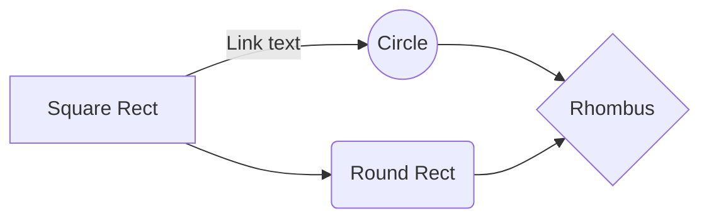

# Структура проекта
___

|первая колонка     |вторая колонка     |третья колонка         |
|--------           |----------------   |--------------------   |
|какая-то инфа      |123123123          |Еще что-то             |
|другая инфа        |979779797          |и ничего               |