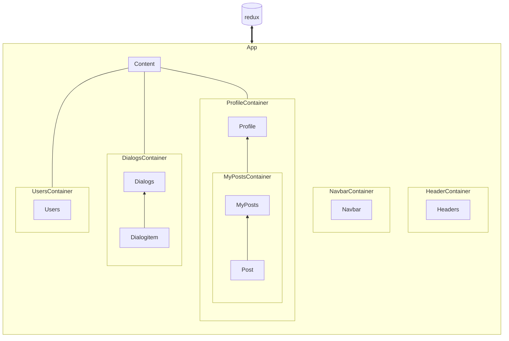

# Структура проекта
___

```mermaid
flowchart TB
    R[(redux)] <==> App

    subgraph App
        direction TB
        Content --- DialogsContainer
        Content --- ProfileContainer
        Content --- UsersContainer
        subgraph Content
      end
      
      subgraph HeaderContainer
        H[Headers]
      end

      subgraph NavbarContainer
        N[Navbar]
      end

      subgraph DialogsContainer
        direction BT
        D2[Dialogitem] --> D1[Dialogs]
      end
      
      subgraph ProfileContainer
        direction BT
        MyPostsContainer --> P1
        P1[Profile]
        subgraph MyPostsContainer
          direction BT
          P3 --> P2
          P2[MyPosts]
          P3[Post]
        end
      end

      subgraph UsersContainer
        U[Users]
      end
    end

   

```