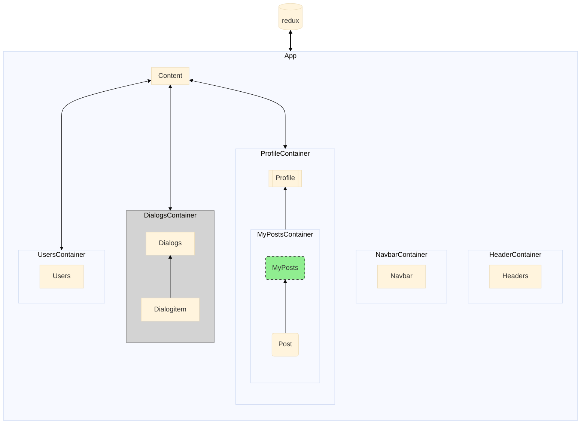
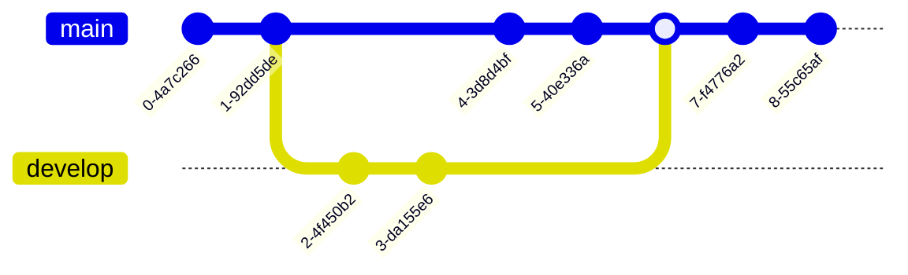
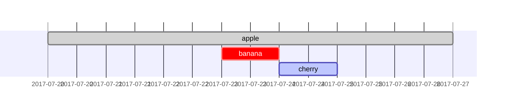
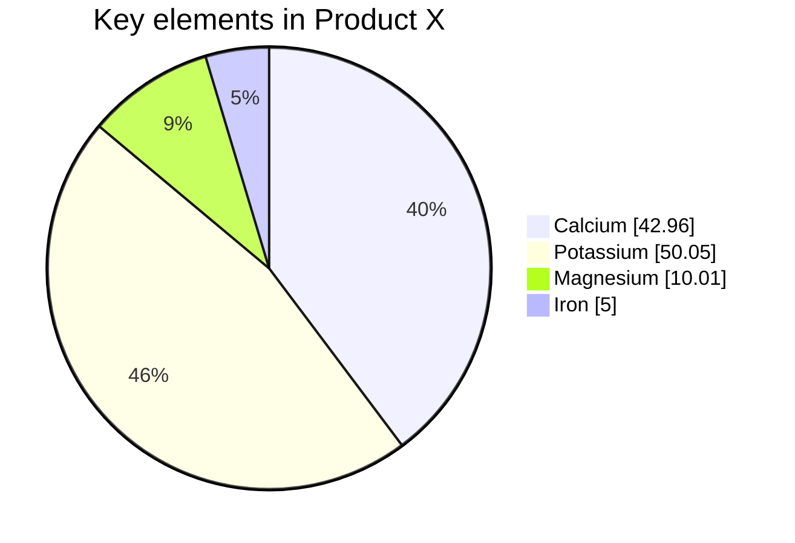
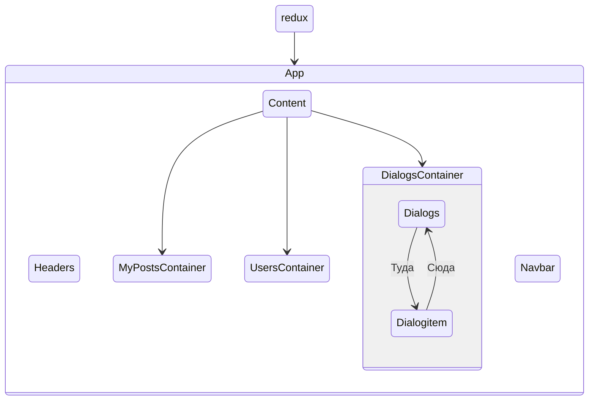

# Структура проекта
___

```mermaid
%%{init: {'securityLevel': 'loose', 'theme':'base'}}%%
flowchart TB
    R[(redux)] <==> App

    subgraph App
        direction TB
        Content <---> DialogsContainer
        Content <---> ProfileContainer
        Content <---> UsersContainer
        subgraph Content
      end
      
      subgraph HeaderContainer
        H[Headers]
      end

      subgraph NavbarContainer
        N[Navbar]
      end

      subgraph DialogsContainer
        direction BT
        D2[Dialogitem] --> D1[Dialogs]
      end
      
      subgraph ProfileContainer
        direction BT
        MyPostsContainer --> P1
        P1[[Profile]]
        subgraph MyPostsContainer
          direction BT
          P3 --> P2
          P2(MyPosts):::green
          P3(Post)
        end
      end

      subgraph UsersContainer
        U[Users]
      end
    end

classDef green fill:lightgreen , stroke-width: 1pt, stroke:#333, stroke-dasharray: 5 5

style DialogsContainer fill:lightgray, stroke:gray, boxTextMargin:20
   

```

```mermaid
 gitGraph
       commit
       commit
       branch develop
       commit
       commit
       checkout main
       commit
       commit
       merge develop
       commit
       commit

```

```mermaid
 gantt
        apple :done, 2017-07-20, 1w
        banana :crit, b, 2017-07-23, 1d
        cherry :active, c, after b a, 1d

```

```mermaid
pie showData
    title Key elements in Product X
    "Calcium" : 42.96
    "Potassium" : 50.05
    "Magnesium" : 10.01
    "Iron" :  5

```

```mermaid
stateDiagram-v2
    redux --> App
    state App {
      Headers
      Navbar
      Content --> DialogsContainer
      state DialogsContainer {
        
        Dialogs --> Dialogitem: Туда
        Dialogitem --> Dialogs: Сюда
      }
      Content --> MyPostsContainer
      Content --> UsersContainer
    }

```